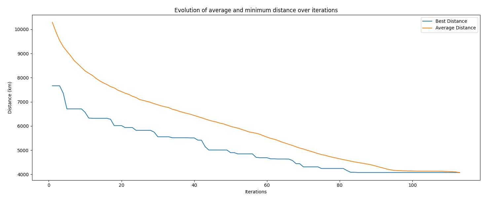

# Genetic TSP Solver<!-- omit from toc -->

- [Introduction](#introduction)
  - [About the Traveling Salesman Problem](#about-the-traveling-salesman-problem)
- [Features](#features)
  - [TSP Solver](#tsp-solver)
  - [Interactive GUI for real-time visualization](#interactive-gui-for-real-time-visualization)
  - [Performance analysis at a glance](#performance-analysis-at-a-glance)
  - [Application to Real Cartographical Data](#application-to-real-cartographical-data)
- [Installation](#installation)
  - [Dependencies](#dependencies)
  - [Running the Application](#running-the-application)
- [Technologies used](#technologies-used)

## Introduction 
This is a genetic algorithm implementation in Python which aims to solve the Traveling Salesman Problem. 

### About the Traveling Salesman Problem
The *Traveling Salesman Problem* (TSP) is a well-known complexity problem which is about finding the shortest path to visit a given number of cities exactly one time, and then return to the first one. It can be modelised as a Hamiltonian circuit in graph theory. 
The TSP is an NP-hard problem.

## Features
### TSP Solver
We are using a genetic algorithm to efficiently solve the TSP.
")

### Interactive GUI for real-time visualization
A user interface in which the user is able to change the algorithm's parameters and to view a given number of smallest paths for each iteration. 

### Performance analysis at a glance
Post-excution, the application displays a graph showing the evolution of average and best distance over the iterations.


### Application to Real Cartographical Data
We integrate real cartographical data from the [*Natural Earth*](https://www.naturalearthdata.com/downloads/10m-cultural-vectors/10m-admin-0-countries/) dataset using geopandas to accurately depict countries. The application also utilizes a `.csv` file with topographical data (Country, City name, Longitude, Latitude) to map cities accurately.

## Installation 
### Dependencies
To ensure the application runs smoothly, install the following dependencies:
- pandas
- geopandas
- matplotlib
- shapely
- customtkinter
  
### Running the Application
In order to use the application with the GUI, simply execute [`app.py`](gui/app.py) from the gui folder :
**For Windows :** 
```
python gui\app.py
```
**For Unix :**
```
python gui/app.py
```

Otherwise, you can still use a legacy version without the GUI, in which you can't modify the parameters without modifying them directly in the code. 
To do so, just run [`main.py`](genetic_algorithm/main.py) from the genetic_algorithm folder :
```
python genetic_algorithm\main.py
```
**For Unix :**
```
python genetic_algorithm/main.py
```

## Technologies used
- Python
- customtkinter
- geopandas
- matplotlib

